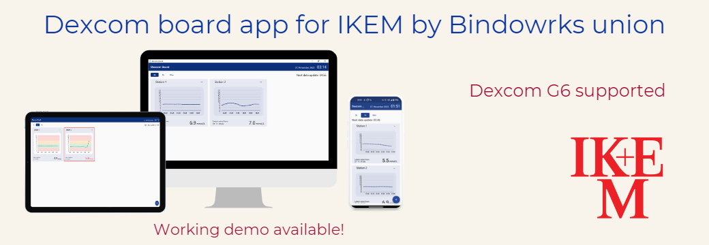

# Dexcom Board

This is a submission for **European Healthcare Hackathon (EHH) 2022**.

**Team name**: Bindworks union

**Team members**: [Matěj Žídek](https://www.linkedin.com/in/matej-z/), [Tomáš Dorda](https://www.linkedin.com/in/tomas-dorda/), [Daniel Šulc](https://www.linkedin.com/in/daniel-%C5%A1ulc-737312151/)

We have chosen **Challenge 5**.

5. Continuous glycemic monitoring in intensive care units
Create an application that allows multiple patients in inpatient wards to be monitored simultaneously
using Dexcom sensors. Utilizing the Dexcom G6 continuous glycemic monitoring system will improve
care for hospitalized patients in ICU beds and integration into a single interface will reduce
staff workload. Teams will be provided with sensors and mobile phones.
___

## Challenge description

### Problems
- Lengthy collection of blood glucose values
- Inconsistent collection system
- Inability to monitor multiple patients at once in real-time
- Lack of notifications about critical glucose levels

### Solution
- A multiplatform (Flutter) application for real-time glucose level monitoring. Supported platforms are: Mobile, Desktop, Tablet & Web.
- Upload patients' snapshots to the FHIR server
- No more additional HW needed
- Transmitter reusability (setup once, use forever)

## How it works
In short, we have rewritten [pydexcom](https://github.com/gagebenne/pydexcom) Python library into Dart so we could create and use it in a Flutter application.
This library allows us interact with Dexcom Share service. The difference from the official Dexcom API is that this library uses a private hidden one,
with which we can fetch real-time glucose levels.

The architecture of our solution is “one station – one Dexcom account”. The staff has to set up this account only once. After the setup, staff must enable sharing in the Dexcom app. The next step is to enter the Dexcom login and password into our app and everything is ready.
Thanks to Android multi-user settings, it is possible to run multiple instances of the 
Dexcom app on one device. This means only one device is needed to be 
paired with all the sensors. If the transmitter “dies” we can 
automatically continue in the monitoring/data collection as long as it is 
linked to the same Dexcom account. It is also possible to use one phone for each patient.

Right now, our project is ready to go. It needs one device for displaying the dashboard, 
one device for Dexcom app/accounts management and that’s it. In the “worst” 
scenario the same Android device can be used both for displaying the dashboard 
and managing the Dexcom app/accounts. The device for managing Dexcom app/accounts 
needs to run the Dexcom app nonstop within the Bluetooth range of all sensors. We have a working demo, which has proved the feasibility of our solution.

The application is also able to upload patients' snapshots to the FHIR server.

## How to run
You can download executables (Windows and/or Android) from the [releases](https://github.com/mzdm/dexcom_board/releases/tag/dev-0.0.11) or 
run the web version from [here](https://dexcom-board.web.app/#/).

**Note**: Make sure to have at least one follower to enable the share service.

**Information for testers**: If you don't have a Dexcom account and connected it to G6 sensor, approach @Daniel Šulc, @Tomáš Dorda or @Matěj Žídek
on the EHH2022 Slack channel. We can send you the credentials.

It should also support macOS, iOS and Linux, but we have not tested it on these platforms.

You can also build and run the application from the source code.
- or run on any platform using:

`flutter run --dart-define FHIR_API_KEY=YOUR_FHIR_API_KEY`

- build Web version using: 

`flutter build web --release --dart-define FHIR_API_KEY=YOUR_FHIR_API_KEY --web-renderer html`
